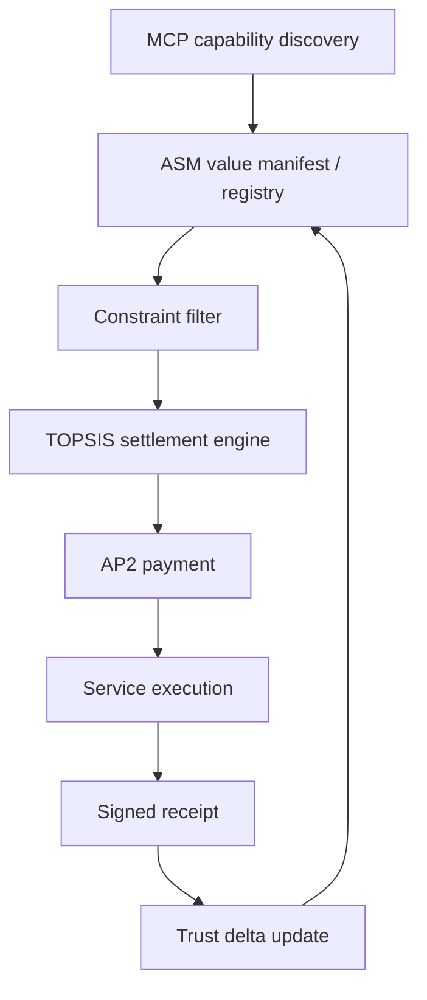

# Agent Service Manifest: A Settlement Protocol for Value-Aware Service Selection in Agent Economies

> **Draft — Complete (Sections 1-8), Revision 2**
> Authors: Yi Guo
> Date: April 2026

---

## Abstract

Autonomous agents increasingly choose among competing AI services before they execute or pay. Existing protocols cover capability discovery (MCP), inter-agent communication (A2A), and payment execution (AP2), but a settlement layer is missing: agents can see what tools do, yet cannot compute what services are worth. We present **Agent Service Manifest (ASM)**, a lightweight settlement protocol — specified as a JSON Schema — that gives agents standardised value descriptors across pricing, quality, SLA, provenance, verification, and payment. Two audits ground the gap: 0/50 MCP-related GitHub repositories expose all four core value classes (pricing + SLA + quality + payment), and 0/600 entries sampled from five MCP registries / directories expose them either. We validate ASM with **70 real-world manifests spanning 47 taxonomies** and a two-stage selection engine (constraint filter + TOPSIS). On 200 synthetic tasks ASM improves preference-weighted utility by **23.1%** over random and cuts cost **59.2%** relative to most-expensive ($p < 10^{-6}$, < 5 ms scoring overhead); on 20 natural-language user requests with explicit preference vectors, ASM is zero-regret on 100% of tasks while the strongest single-axis policy is zero-regret on 75%. To test whether a frontier LLM makes the protocol redundant, we replicate a 36-task ranking suite across three LLMs from three labs (DeepSeek-V4-flash, Qwen3-Max, Kimi K2.5): swapping raw provider HTML for ASM manifests raises top-1 accuracy from **63.9–72.2% to 100.0%** with non-overlapping 95% CIs. The protocol's contribution is precisely this surface change — converting brittle HTML parsing into deterministic numerical comparison.

---

## 1. Introduction

The AI service economy is undergoing a fundamental transformation. As autonomous agents become the primary consumers of AI services — invoking language models, generating images, synthesizing speech, and orchestrating compute resources on behalf of human users — the scale and frequency of service selection decisions has grown by orders of magnitude. A single complex agent workflow may require selecting among dozens of candidate services across multiple categories, each with distinct pricing structures, quality profiles, and operational characteristics.

This transformation has been supported by significant advances in agent infrastructure protocols. The **Model Context Protocol** (MCP) [1], introduced by Anthropic and now supported by major platforms including OpenAI and Google, provides a standardized mechanism for agents to discover and invoke external tools. Google's **Agent-to-Agent Protocol** (A2A) [2] enables structured communication between agents, while the **Agent Payment Protocol** (AP2) [3] defines secure transaction execution for agent-initiated purchases. Together, these protocols address the fundamental questions of *what tools can do*, *how agents communicate*, and *how to pay safely*.

However, a critical gap remains: **no existing protocol tells an agent what a service is worth**.

When an agent faces three subtitle generation APIs priced at $0.10/minute, $0.03/minute, and free (with a 5-minute queue), it possesses no structured data to make an informed choice. The pricing information exists only in human-readable HTML pages with inconsistent formats. Quality data is scattered across blog posts, social media discussions, and vendor marketing materials. SLA parameters — latency percentiles, uptime guarantees, rate limits — are buried in documentation that varies wildly in structure and completeness. The result is that **agent intelligence drops to zero at the service selection step**: regardless of how capable the underlying model is, it cannot optimize over information it cannot parse.

This is not merely an efficiency concern — it is a **structural deficiency** in the emerging agent economy. Consider an autonomous coding agent (e.g., Claude Code, Cursor) executing a complex task that requires invoking an LLM (3+ candidates), generating an image (5+ candidates), and running code on a GPU (3+ candidates). If each selection is made blindly — choosing the most expensive, the cheapest, or the most well-known — the total cost is far from optimal: in §6.5 we show that a "more expensive = better" baseline pays **2.4× the cost** of an ASM-guided selection over 200 multi-category tasks, while delivering essentially identical quality. Multiplied by millions of daily agent transactions, the aggregate economic waste is substantial.

We argue that the root cause is not insufficient model intelligence but **missing data infrastructure**. Just as the Nutrition Facts label transformed consumer food purchasing from subjective judgment to informed comparison, AI services need a standardized, machine-readable "value label" that makes their economic properties computable.

We summarize this design goal as: *"Agents shouldn't shop. They should settle."* That is, an agent confronted with a candidate set should not enter an open-ended evaluation loop — fetching pages, parsing free-form text, and inferring trade-offs — but should reach a *settled* decision in a single, deterministic step over structured data. ASM is the substrate that makes settlement, rather than shopping, the default operating mode.

To test whether this gap exists in current practice rather than only in theory, we audit 50 public repositories returned by four MCP-related GitHub queries. The audit finds no repository exposing ASM-style structured value metadata, only 18% exposing SLA or rate-limit signals in public README/config text, and no repository exposing all four core value classes (pricing, SLA, quality, payment). This motivates ASM as a response to a measurable missing layer in the current MCP-adjacent ecosystem, not merely as an additional schema.

In this paper, we present **Agent Service Manifest (ASM)**, an open settlement protocol designed to fill this gap. ASM provides:

1. **A standardized value descriptor** — a JSON Schema specification covering pricing (open billing dimensions with tiered and conditional pricing), quality (third-party benchmark references with trust transparency), SLA (latency, throughput, uptime, rate limits), provenance, and payment methods (pre-wired for AP2 interop).

2. **A hierarchical taxonomy** — a 47-category classification system (e.g., `ai.llm.chat`, `ai.vision.image_generation`, `infra.compute.gpu`, `tool.devops.monitoring`, `tool.productivity.calendar`) that enables agents to search, filter, and match services across categories using prefix queries.

3. **A two-stage selection engine** — combining hard constraint filtering with TOPSIS (Technique for Order Preference by Similarity to Ideal Solution) multi-criteria ranking, producing preference-aware recommendations with full explainability.

4. **An MCP-compatible integration path** — ASM can be deployed as an independent `.well-known/asm` endpoint (Phase 1), embedded as `x-asm` annotations in MCP ToolAnnotations (Phase 2), or adopted as native MCP fields (Phase 3), ensuring zero breaking changes at each stage.

We validate ASM with **70 real-world service manifests spanning 47 taxonomies**, now carrying explicit provenance metadata, and with an ecosystem audit of 50 public MCP-adjacent repositories showing that structured value metadata is absent in current practice. A 200-task A/B evaluation against two baseline policies (uniform random and most-expensive-first) shows that the same candidate set produces different optimal selections under different user preference profiles, with statistically significant gains in both selection quality and cost efficiency — confirming that service selection is inherently a multi-criteria optimization problem that cannot be solved by heuristics or model intuition alone.

The remainder of this paper is organized as follows. Section 2 formalizes the service selection problem. Section 3 surveys related work. Section 4 presents the ASM protocol design. Section 5 describes the reference implementation. Section 6 evaluates ASM across multiple scenarios. Section 7 discusses limitations, trust mechanisms, and future directions. Section 8 concludes.

---

## 2. Problem Formulation

### 2.1 Setting

We consider a setting where an autonomous agent $\mathcal{A}$ receives a task $T$ from a user $U$ and must select one or more services from a candidate set $\mathcal{S} = \{s_1, s_2, \ldots, s_n\}$ to fulfill the task. Each service $s_i$ is characterized by a multi-dimensional value vector:

$$\mathbf{v}_i = (c_i, q_i, l_i, r_i, \mathbf{e}_i)$$

where:
- $c_i \in \mathbb{R}_{\geq 0}$ is the cost (normalized to a per-unit basis)
- $q_i \in [0, 1]$ is the quality score (normalized from heterogeneous benchmarks)
- $l_i \in \mathbb{R}_{> 0}$ is the latency (p50, in seconds)
- $r_i \in [0, 1]$ is the reliability (uptime probability)
- $\mathbf{e}_i$ is a vector of category-specific extension attributes

### 2.2 User Preferences

The user specifies preferences through two mechanisms:

**Hard constraints** $\mathcal{C}$: A set of inequality predicates that services must satisfy to be considered. For example:

$$\mathcal{C} = \{q_i \geq 0.8, \; l_i \leq 5.0, \; c_i \leq 0.10\}$$

Services violating any constraint are eliminated from the candidate set.

**Soft preferences** $\mathbf{w}$: A weight vector $\mathbf{w} = (w_c, w_q, w_l, w_r)$ where $\sum w_j = 1$ and $w_j \geq 0$, representing the relative importance of each dimension.

### 2.3 Selection Problem

The agent's objective is to find the service $s^*$ that maximizes a preference-weighted multi-criteria score over the feasible set:

$$s^* = \arg\max_{s_i \in \mathcal{S}_{\text{feas}}} \; f(\mathbf{v}_i, \mathbf{w})$$

where $\mathcal{S}_{\text{feas}} = \{s_i \in \mathcal{S} \mid s_i \text{ satisfies } \mathcal{C}\}$ is the set of services passing all hard constraints, and $f$ is a scoring function that maps value vectors and preference weights to a scalar ranking score.

### 2.4 Key Challenges

This formulation reveals several challenges that motivate ASM:

**C1: Heterogeneous pricing.** Real-world AI services use at least 8 distinct billing models — per-input-token, per-output-token, per-image, per-second-of-video, per-character, per-GPU-second, per-request, and subscription-with-credits. A single LLM may bill for both input and output tokens at different rates, with conditional pricing when context exceeds a threshold. Converting these into comparable per-unit costs requires a standardized schema with explicit billing dimension declarations.

**C2: Incommensurable quality.** Quality metrics vary by category: LLMs use Elo scores (LMSYS Arena), image generators use FID (lower is better), TTS systems use MOS (1–5 scale). There is no universal quality score. ASM addresses this by preserving the original metric and scale in the manifest, with normalization performed at scoring time.

**C3: Non-structured information.** Currently, pricing, quality, and SLA data exists primarily in human-readable formats (HTML pricing pages, blog posts, API documentation). LLM-based extraction from these sources is probabilistic, non-reproducible, and costly at scale. For an agent comparing 100 services, reading 300+ web pages would consume thousands of tokens per selection — a cost that dwarfs the savings from better selection.

**C4: Trust asymmetry.** Service providers have economic incentives to overstate quality and understate latency. Without a verification mechanism, agents cannot distinguish self-reported claims from independently verified measurements.

**C5: Preference diversity.** The optimal service depends entirely on who is asking. A user prioritizing cost will choose differently from one prioritizing quality, even when facing the identical candidate set. This rules out any "one size fits all" ranking and necessitates a parameterized scoring function.

### 2.5 Relationship to LLM Routing

It is important to distinguish the ASM selection problem from **LLM routing** as studied in RouteLLM [4] and related work [5]. LLM routing operates *within a single category* (e.g., choosing between GPT-4 and Mixtral for a given query based on predicted difficulty), using ML models trained on preference data. ASM operates *across categories and providers* (e.g., choosing between an LLM service, an image generation service, and a GPU compute service), using structured metadata rather than learned routers. The two are complementary: ASM selects the category and provider, then a system like RouteLLM can further optimize the specific model within that provider.

---

## 3. Related Work

### 3.1 Agent Communication Protocols

The agent protocol landscape has been systematically surveyed by [6], who propose a two-dimensional taxonomy: Context-Oriented (connecting agents to tools/data) versus Inter-Agent (connecting agents to each other), crossed with General-Purpose versus Domain-Specific. MCP [1] occupies the Context-Oriented × General-Purpose quadrant, providing standardized tool discovery and invocation. A2A [2] addresses Inter-Agent communication. The Agent Communication Protocol (ACP) and Agent Network Protocol (ANP) extend these to additional settings.

Critically, this taxonomy has no dimension for **service economics** — none of the surveyed protocols address pricing, quality comparison, or value-based selection. ASM introduces a third dimension to this framework: the Service Economics layer that makes value computable alongside capability and communication.

### 3.2 Agent-as-a-Service

The most closely related academic work is **AaaS-AN** (Agent-as-a-Service based on Agent Network) [7], which proposes a service-oriented agent paradigm based on the RGPS (Role-Goal-Process-Service) standard. AaaS-AN defines a dynamic agent network with service discovery, registration, and orchestration capabilities, validated at the scale of 100+ agent services.

While AaaS-AN and ASM both touch service discovery, their focus is fundamentally different:

| Dimension | AaaS-AN | ASM |
|-----------|---------|-----|
| Core problem | How agents organize and collaborate | How agents evaluate and select services |
| Service discovery | "Who can collaborate" | "Who offers the best value" |
| Pricing support | None | Open billing dimensions + tiered/conditional |
| Quality metrics | None | Third-party benchmarks + trust flags |
| SLA | None | Latency, throughput, uptime, rate limits |
| Scoring function | None | Filter + TOPSIS with user preferences |

The two are complementary: AaaS-AN orchestrates the agent team, and ASM optimizes each team member's purchasing decisions.

### 3.3 LLM Routing

**RouteLLM** [4] (LMSYS, 4.8K GitHub stars) introduces learned routers that dynamically select between strong and weak LLMs based on query difficulty, achieving 85% cost reduction while maintaining 95% of GPT-4 performance. Four router architectures are evaluated: matrix factorization (recommended), weighted Elo, BERT classifier, and LLM-as-judge.

The **Dynamic Model Routing and Cascading Survey** [5] provides a comprehensive taxonomy of LLM routing approaches, categorizing them by decision timing (pre-routing, mid-generation, post-generation), information used (query features, model metadata, historical performance), and optimization objective (cost, quality, latency).

ASM and LLM routing are complementary systems operating at different levels:

| Dimension | LLM Routing | ASM |
|-----------|-------------|-----|
| Decision timing | Runtime (per-request) | Selection time (per-task) |
| Input data | Query content/difficulty | Structured service metadata |
| Scope | Single category (LLMs only) | Cross-category |
| Method | ML models (trained on preference data) | Mathematical optimization (no training) |
| Complementarity | Optimizes *within* a provider | Optimizes *across* providers and categories |

A complete agent service stack would use ASM to select the category and provider, then RouteLLM (where applicable) to select the specific model.

### 3.4 Secure Payment and Trust

**AP2** (Agent Payment Protocol) [3] by Google defines how agents securely execute payments using Verifiable Digital Credentials (VDCs), Intent Mandates for pre-authorization, and role-separated architecture (user / shopping agent / credential provider / merchant / payment processor). AP2 solves *how to pay* but not *what to buy*.

**Agent Receipts** [8] provides cryptographically signed execution records following the W3C Verifiable Credentials standard, creating an immutable audit trail of agent actions. The ASM-Receipts interoperation forms a complete trust chain: ASM declares expected service quality (pre-selection), the service executes, and a signed receipt records actual delivery (post-execution). Comparing declared vs. actual yields a dynamic trust score:

$$\text{trust}(s_i) = g\left(\sum_{t=1}^{N} \| \mathbf{v}_i^{\text{declared}} - \mathbf{v}_i^{(t), \text{actual}} \| \right)$$

where $g$ is a monotonically decreasing function and $N$ is the number of past transactions.

**Cao et al.** (WWW 2026) proposed agent-side reputation graphs for service selection, where agents collectively maintain reputation scores based on observed execution outcomes. ASM differs by emitting structured receipts at the protocol layer rather than relying on distributed agent-side observation collection; this design choice keeps verification provider-centric (the service signs its own receipts) rather than community-dependent, reducing coordination overhead at the cost of requiring provider participation.

### 3.5 MCP Ecosystem

The MCP ecosystem has been analyzed from a security perspective by [9], who identify 4 attacker types and 16 threat scenarios across the MCP lifecycle. Their analysis of trust boundaries is directly relevant to ASM: the `self_reported` flag in ASM manifests addresses the same "trusted vs. untrusted server" distinction that MCP's ToolAnnotations acknowledges with its "hints should not be trusted" caveat.

The **MCP 2026 Roadmap** [10] prioritizes transport evolution, agentic communication, governance maturity, and enterprise readiness — but contains **no mention of pricing, marketplace, or service economics**. This confirms that ASM addresses a gap the MCP team has not planned to fill at the time of writing.

Concurrently, **AWS has released a Marketplace MCP Server** [11] that enables agent-driven product discovery, comparison, and procurement within the AWS Marketplace. This validates the demand for agent-automated service evaluation but implements it as a closed, platform-locked solution. ASM provides the same capability as an open, vendor-neutral standard.

### 3.6 Multi-Criteria Decision Making

ASM's scoring engine draws on the rich MCDM (Multi-Criteria Decision Making) literature, particularly its application to cloud service selection [12]. We adopt **TOPSIS** [13] (Technique for Order Preference by Similarity to Ideal Solution) as our primary ranking method due to its mathematical soundness, computational efficiency, and wide acceptance in the service selection literature. TOPSIS simultaneously considers distance to the positive ideal solution (best possible) and negative ideal solution (worst possible), producing more robust rankings than simple weighted averages that can be skewed by extreme values in a single dimension.

---

## 4. Protocol Design

This section presents the ASM protocol specification: the manifest schema (§4.1), the hierarchical taxonomy (§4.2), the pricing engine (§4.3), the quality and trust model (§4.4), and the integration architecture with MCP and Signed Receipts (§4.5).

### 4.1 Manifest Schema

An ASM manifest is a JSON document conforming to JSON Schema Draft 2020-12. The design follows a **minimal core, maximal optional** philosophy: only three fields are required, while rich optional modules allow progressive disclosure of service value.

**Required fields:**

| Field | Type | Description |
|-------|------|-------------|
| `asm_version` | `string` (const) | Protocol version (`"0.3"`) |
| `service_id` | `string` | Globally unique identifier. Format: `<provider>/<service>@<version>` |
| `taxonomy` | `string` | Standardized category (see §4.2) |

This means the simplest valid ASM manifest is just 3 lines of JSON — a deliberately low barrier to adoption.

**Optional modules:**

| Module | Purpose | Key Fields |
|--------|---------|------------|
| `pricing` | Cost structure | open `billing_dimensions[]`, `tiers`, `conditions`, `batch_discount`, `free_tier` |
| `quality` | Performance metrics | `metrics[]` (name, score, scale, benchmark, `self_reported`), `leaderboard_rank` |
| `sla` | Reliability guarantees | `latency_p50`, `latency_p99`, `throughput`, `uptime`, `rate_limit`, `regions` |
| `payment` | Payment methods | `methods[]`, `auth_type`, `ap2_endpoint` |
| `provenance` | Source traceability | `source_url`, `retrieved_at`, `last_verified_at`, `verification_status`, `notes` |
| `extensions` | Category-specific | Namespaced fields (e.g., `llm.supports_vision`, `image_gen.max_resolution`) |

**v0.3 additions** (for Signed Receipts integration):

| Field | Type | Description |
|-------|------|-------------|
| `updated_at` | `date-time` | ISO 8601 timestamp of last manifest update |
| `ttl` | `integer` | Cache time-to-live in seconds (default: 3600) |
| `receipt_endpoint` | `uri` | Endpoint for obtaining signed receipts post-execution |
| `verification` | `object` | Verification config: `protocol`, `public_key`/`public_key_url`, `receipt_schema_version` |

The `updated_at` + `ttl` pair solves the **manifest freshness problem**: agents can determine when data was last refreshed and when to re-fetch, avoiding stale pricing or quality data.

### 4.2 Hierarchical Taxonomy

ASM defines a 47-category taxonomy using a dot-separated hierarchical format: `<domain>.<category>[.<subcategory>]`. This enables prefix-based queries — an agent searching for `ai.llm.*` retrieves all LLM services regardless of subcategory. The taxonomy spans three top-level domains: AI/ML services (`ai.*`), infrastructure (`infra.*`), and developer/productivity tooling (`tool.*`):

```
ai.llm.chat                      ai.audio.tts                    tool.communication.email
ai.llm.completion                ai.audio.stt                    tool.communication.sms
ai.llm.embedding                 ai.audio.music                  tool.data.search
ai.vision.image_generation       ai.code.generation              tool.data.scraping
ai.vision.image_editing          ai.data.extraction              tool.data.pdf
ai.vision.ocr                    ai.translation                  tool.data.visualization
ai.video.generation              ai.weather                      tool.devops.ci
ai.video.subtitle                infra.compute.gpu               tool.devops.monitoring
ai.video.editing                 infra.compute.serverless        tool.devops.deployment
infra.storage.object             infra.storage.vector            tool.productivity.calendar
infra.database.serverless        infra.database.cache            tool.productivity.document
infra.auth.identity              infra.dns                       tool.productivity.spreadsheet
infra.secrets                    infra.observability.error       tool.productivity.todo
tool.payment.processing          tool.communication.messaging    tool.productivity.knowledge
... (47 categories total)
```

The taxonomy is validated by a regex pattern: `^[a-z]+\.[a-z_]+(?:\.[a-z_]+)?$`. This ensures machine-parseable, collision-free category identifiers while remaining human-readable.

**Design rationale.** We chose a flat-with-hierarchy approach over ontological classification (e.g., OWL) for three reasons: (1) agents need fast prefix matching, not inference; (2) the taxonomy must be extensible without breaking existing manifests; (3) simplicity maximizes adoption — a provider can assign a taxonomy in seconds.

### 4.3 Pricing Engine

Real-world AI service pricing exhibits significant heterogeneity (Challenge C1 from §2.4). ASM addresses this with a multi-dimensional pricing model:

**Billing dimensions.** A single service can declare multiple billing dimensions. For example, an LLM charges separately for input and output tokens:

```json
{
  "billing_dimensions": [
    { "dimension": "input_token",  "unit": "per_1M", "cost_per_unit": 3.00,  "currency": "USD" },
    { "dimension": "output_token", "unit": "per_1M", "cost_per_unit": 15.00, "currency": "USD" }
  ]
}
```

ASM recommends common dimension identifiers such as `input_token`, `output_token`, `token`, `character`, `word`, `image`, `pixel`, `second`, `minute`, `request`, `gpu_second`, `byte`, `query`, and `custom`, while allowing domain-specific dimensions such as `browser_minute`, `email`, `ci_minute`, or `api_call`. The `unit` field similarly recommends `per_1`, `per_1K`, and `per_1M` while allowing service-specific units such as `per_page`, `per_message`, or `per_1_gb_month`.

**Tiered pricing.** Volume discounts are expressed as tier arrays:

```json
{
  "tiers": [
    { "up_to": 1000000, "cost_per_unit": 3.00 },
    { "up_to": 10000000, "cost_per_unit": 2.50 },
    { "up_to": "unlimited", "cost_per_unit": 2.00 }
  ]
}
```

**Conditional pricing.** Context-dependent pricing (e.g., LLM pricing that doubles when context exceeds 200K tokens) is expressed as:

```json
{
  "conditions": { "when": "context_tokens > 200000", "cost_per_unit": 6.00 }
}
```

**Cost normalization.** For scoring purposes, multi-dimensional pricing is reduced to a single representative cost. For LLMs with input/output token pricing, we use a weighted estimate parameterized by the input-output ratio $\rho$:

$$c_{\text{repr}}(\rho) = (1 - \rho) \cdot c_{\text{input}} + \rho \cdot c_{\text{output}}$$

The default value $\rho = 0.7$ reflects empirical observation that conversational LLM responses are typically 2–3× longer than prompts. The reference implementation exposes $\rho$ as the `io_ratio` parameter, with three documented presets: $\rho = 0.3$ for retrieval-heavy / RAG workloads (long prompts, short answers), $\rho = 0.5$ for balanced workloads, and $\rho = 0.8$ for long-form generation. Making this ratio explicit avoids burying a workload assumption inside the protocol; agents that know their access pattern can calibrate cost ranking accordingly. For single-dimension services, the primary billing dimension is used directly.

### 4.4 Quality and Trust Model

ASM implements a three-layer trust architecture that addresses the trust asymmetry challenge (C4):

**Layer 1: Source Transparency.** Every quality metric carries a `self_reported` boolean flag. When `self_reported: true`, the metric is a provider's own claim; when `false`, it references an independent benchmark. This simple binary flag enables agents to apply differential weighting — for example, discounting self-reported claims by 20%.

**Layer 2: External Verification.** Quality metrics reference public benchmarks with structured metadata:

```json
{
  "name": "LMSYS_Elo",
  "score": 1290,
  "scale": "Elo",
  "benchmark": "LMSYS Chatbot Arena",
  "benchmark_url": "https://chat.lmsys.org/?leaderboard",
  "evaluated_at": "2026-03-15",
  "self_reported": false
}
```

The `benchmark_url` and `evaluated_at` fields make claims independently verifiable — an agent (or auditor) can check the source.

**Layer 3: Signed Receipts Integration.** The most novel trust mechanism in ASM is its integration with cryptographically signed execution receipts. The trust chain operates as follows:

1. **Pre-selection**: ASM manifest declares expected service quality ($\mathbf{v}^{\text{declared}}$)
2. **Execution**: Agent invokes the service via MCP
3. **Post-execution**: Agent obtains a signed receipt from `receipt_endpoint`, recording actual delivery metrics ($\mathbf{v}^{\text{actual}}$)
4. **Trust update**: Agent computes trust delta and updates trust score

The **trust delta** for a single dimension is:

$$\delta(d, a) = \frac{|d - a|}{|d|}$$

where $d$ is the declared value and $a$ is the actual value. A delta of 0 indicates perfect accuracy; a delta of 1.25 indicates the actual latency was 125% worse than declared.

Trust scores are computed using **exponential decay weighting** over receipt history, ensuring that recent performance matters more than historical behavior:

$$w(t) = \exp\left(-\frac{\ln 2 \cdot \text{age}(t)}{\tau}\right)$$

where $\tau$ is the half-life (default: 1 week). The weighted trust score for dimension $j$ is:

$$\bar{\delta}_j = \frac{\sum_{t=1}^{N} w(t) \cdot \delta_j^{(t)}}{\sum_{t=1}^{N} w(t)}$$

The overall trust score combines all dimensions:

$$\text{trust}(s_i) = \max\left(0, \; 1 - \frac{1}{|J|}\sum_{j \in J} \bar{\delta}_j\right)$$

where $J = \{\text{cost}, \text{quality}, \text{latency}, \text{uptime}\}$.

**Confidence** increases asymptotically with the number of receipts:

$$\text{confidence}(n) = 1 - \exp(-n/5)$$

reaching 0.86 at 10 receipts and 0.98 at 20 receipts.

### 4.5 Integration Architecture



ASM is designed for progressive integration with the existing agent protocol stack, following a three-phase adoption path:

**Phase 1: Independent endpoint** (current). Services publish ASM manifests at `.well-known/asm` or in a shared registry. Agents query the registry via MCP tools. This requires no changes to MCP itself.

**Phase 2: MCP ToolAnnotations embedding**. ASM fields are embedded as `x-asm` annotations within MCP's existing `ToolAnnotations` metadata. This leverages MCP's extensibility without modifying the core specification:

```json
{
  "name": "generate_image",
  "annotations": {
    "x-asm": {
      "service_id": "bfl/flux-1.1-pro@1.1",
      "taxonomy": "ai.vision.image_generation",
      "pricing": { "billing_dimensions": [{ "dimension": "image", "unit": "per_1", "cost_per_unit": 0.04 }] }
    }
  }
}
```

**Phase 3: Native MCP fields**. If adopted through a Specification Enhancement Proposal (SEP), ASM fields become first-class MCP properties, eliminating the `x-asm` prefix.

The **Signed Receipts integration** follows the W3C Verifiable Credentials data model. A receipt contains:

```json
{
  "@context": "https://www.w3.org/2018/credentials/v1",
  "type": ["VerifiableCredential", "ServiceExecutionReceipt"],
  "credentialSubject": {
    "asm:service_id": "anthropic/claude-sonnet-4@4.0",
    "asm:declared": { "latency_seconds": 0.8, "quality_score": 0.8167 },
    "asm:actual": { "latency_seconds": 0.82, "quality_score": 0.81 },
    "asm:trust_delta": { "latency": 0.025, "quality": 0.008 }
  },
  "proof": { "type": "Ed25519Signature2020", "proofValue": "z..." }
}
```

The `asm:` namespace is registered for receipt type fields, enabling full traceability from service selection through execution to verification.

---

## 5. Reference Implementation

We provide a complete reference implementation consisting of three components: a Python scoring engine (§5.1), a TypeScript MCP server (§5.2), and demonstration scripts (§5.3). All components are open-source under the MIT license.

### 5.1 Scoring Engine

The scoring engine (`scorer/scorer.py`, ~700 lines of pure Python with no external dependencies beyond the standard library and an optional `scipy` import for Welch's t-test) implements the three-stage selection pipeline. It exposes the `io_ratio` parameter described in §4.3, supports manifest filtering by hard constraints, and includes the trust-delta scoring described below:

**Stage 1: Constraint Filtering.** Hard constraints are evaluated as conjunction of inequality predicates. Services violating any constraint are eliminated:

```python
def filter_services(services, constraints):
    # Taxonomy prefix match, min_quality, max_cost,
    # max_latency_s, min_uptime
```

**Stage 2: Multi-Criteria Ranking.** Two scoring methods are implemented:

*Weighted Average* (v0.2): Min-max normalization followed by weighted sum. Cost and latency are inverted (lower = better). Simple and transparent, suitable for demonstrations.

*TOPSIS* (v1.0): The full TOPSIS algorithm as described in [13]:

1. Construct decision matrix $\mathbf{X} \in \mathbb{R}^{m \times 4}$ (services × criteria)
2. Vector-normalize: $r_{ij} = x_{ij} / \sqrt{\sum_i x_{ij}^2}$
3. Apply weights: $v_{ij} = w_j \cdot r_{ij}$
4. Identify positive ideal $A^+ = (\max_i v_{ij} \text{ for benefit}, \min_i v_{ij} \text{ for cost})$ and negative ideal $A^-$
5. Compute Euclidean distances: $d_i^+ = \|\mathbf{v}_i - A^+\|$, $d_i^- = \|\mathbf{v}_i - A^-\|$
6. Closeness coefficient: $C_i = d_i^- / (d_i^+ + d_i^-)$

TOPSIS produces more robust rankings than weighted averages because it simultaneously considers proximity to the best possible outcome and distance from the worst.

**Stage 3: Trust Delta Scoring** (v1.1): Computes trust scores from receipt history using exponential decay weighting (see §4.4). Trust-adjusted final scores are:

$$\text{score}_{\text{final}} = (1 - \alpha) \cdot \text{score}_{\text{TOPSIS}} + \alpha \cdot \text{trust} \cdot \text{confidence}$$

where $\alpha = 0.2$ by default. Services with high trust (accurate declarations) receive a boost; services with inflated claims are penalized.

**Manifest parsing.** The parser handles heterogeneous quality scales through automatic normalization:

| Scale | Normalization to [0, 1] |
|-------|------------------------|
| Elo (800–1400) | $(s - 800) / 600$ |
| 0–100 | $s / 100$ |
| 1–5 (MOS) | $(s - 1) / 4$ |
| Lower-is-better (FID) | $\max(1 - s/50, 0)$ |

This addresses Challenge C2 (incommensurable quality) by making all quality scores comparable at scoring time while preserving original values in the manifest.

### 5.2 Registry Server

The registry server (`registry/src/`, TypeScript) is dual-protocol: it speaks MCP over stdio for direct agent integration (`src/index.ts`) and HTTP/JSON for language-agnostic clients (`src/http.ts`, Express). Both surfaces share the same manifest store and scoring core, so an agent can connect over MCP while a dashboard, evaluator, or non-Claude language runtime queries the same service via REST. Six tools are exposed:

| Tool | Parameters | Description |
|------|-----------|-------------|
| `asm_list` | — | List all registered services |
| `asm_get` | `service_id` | Retrieve full manifest by ID |
| `asm_query` | `taxonomy`, `max_cost`, `min_quality`, `max_latency_s`, `input_modality`, `output_modality` | Multi-filter query |
| `asm_compare` | `service_ids[]` (2–5) | Side-by-side comparison table |
| `asm_score` | `taxonomy`, `w_cost`, `w_quality`, `w_speed`, `w_reliability` | Weighted scoring with ranking |
| `asm_taxonomies` | — | List available categories |

The server loads manifests from the `manifests/` directory at startup and exposes them through both the MCP stdio transport and an HTTP API. Any MCP-compatible client (Claude Desktop, Cursor, etc.) can connect over MCP, while an HTTP client can issue equivalent calls — for example `POST /api/score` — to obtain a ranked list with the same TOPSIS scoring logic.

**Architecture decision.** We implemented the MCP server in TypeScript (rather than Python) to match the MCP SDK's primary language and to demonstrate that ASM is language-agnostic — the schema is the contract, not the implementation.

### 5.3 Demonstration Scripts

Two demonstration scripts validate the end-to-end pipeline:

**E2E Demo** (`demo/e2e_demo.py`): Simulates 5 scenarios where an agent selects services across categories:

1. *Cost-first LLM selection* — budget chatbot
2. *Quality-first image generation* — product photography
3. *Quality-first TTS* — podcast voiceover
4. *Budget video generation* — social media clip
5. *Cross-category pipeline* — summarize video + generate thumbnail + add voiceover

Each scenario demonstrates that the same candidate set produces different optimal selections under different preference profiles.

**Signed Receipts Demo** (`demo/receipts_demo.py`): Demonstrates the trust delta pipeline:

1. Trust delta formula with worked examples
2. Exponential decay weight visualization
3. Full trust pipeline with honest vs. dishonest services (20 simulated receipts each)
4. Trust-adjusted re-ranking showing how dishonest services are penalized
5. ASM v0.3 manifest with receipt fields

---

## 6. Evaluation

We evaluate ASM along seven dimensions: evidence of the missing value layer in current MCP repositories (§6.0), coverage of real-world pricing heterogeneity (§6.1), scoring behavior across preference profiles (§6.2), trust delta effectiveness (§6.3), protocol overhead (§6.4), a controlled A/B comparison against baseline selection policies (§6.5), and selection regret against stronger heuristic baselines (§6.6).

### 6.0 Evidence of the Missing Value Layer in Current MCP Repositories

To test whether ASM addresses a real ecosystem gap rather than an invented abstraction, we sampled 50 public repositories returned by four MCP-related GitHub queries: `topic:mcp-server`, `mcp server in:name,description`, `modelcontextprotocol server in:readme`, and `mcp-server in:name,description`. The inclusion rule was simple and reproducible: repositories were included in descending GitHub search order until the 50-repository sample was filled. We did not manually replace repositories after sampling. For each repository, the script scans public `README.md`, `README.mdx`, `package.json`, `pyproject.toml`, and `mcp.json` files when present. It classifies five value-metadata classes by keyword matching: pricing, SLA/rate-limit, quality/benchmark, payment, and ASM/x-asm structured metadata. The audit is intentionally conservative: it is a public-text audit, not a manual pricing verification, and can produce both false positives (e.g., incidental mentions of "quality") and false negatives (metadata hidden in docs outside the scanned files). The audit script, sampled repository list, raw snippets, labels, and summary outputs are included in `experiments/mcp_ecosystem_audit.py` and `experiments/results/mcp_ecosystem_audit.*`.

**Table 0: MCP ecosystem value metadata coverage (n=50 public repositories).**

| Metadata class | Repositories | Coverage |
|----------------|-------------:|---------:|
| Pricing mentions | 16 / 50 | 32.0% |
| SLA or rate-limit mentions | 9 / 50 | 18.0% |
| Quality or benchmark mentions | 22 / 50 | 44.0% |
| Payment mentions | 5 / 50 | 10.0% |
| Structured ASM / `x-asm` metadata | 0 / 50 | 0.0% |
| All four core value classes | 0 / 50 | 0.0% |

The result supports the paper's necessity claim: current MCP repositories may expose capabilities, examples, and authentication instructions, but they rarely expose the computable value surface an autonomous agent needs before selection. Even generous text matching finds complete pricing/SLA/quality/payment coverage in 0% of the sample, and no repository exposes ASM-style structured metadata.

#### 6.0a Registry-Level Audit (n = 600 entries across five sources)

The 50-repository audit looks at how individual MCP servers describe themselves; we also need to know how the **registries and directories** that agents query for discovery describe those same servers. We therefore sampled 600 entries across five sources: the official MCP registry (`registry.modelcontextprotocol.io/v0/servers`, n=140), Glama (`glama.ai/api/mcp/v1/servers`, n=138), MCP Atlas (`mcpatlas.dev/browse`, n=42), MCPCorpus (the Hugging Face `Website/mcpso_servers_cleaned.json` snapshot, n=279), and FindMCP (n=1, the only entry with a stable scrape surface at audit time). For each entry the audit script labels six metadata classes — pricing, SLA/rate-limit, quality/benchmark, payment, provenance, and security/trust — at four granularities: `absent`, `human_readable`, `structured_unverified`, and `machine_actionable`.

**Table 0a: Value-metadata coverage across five MCP registries / directories (n = 600).**

| Field | Absent | Human-readable | Structured | Machine-actionable |
|---|---:|---:|---:|---:|
| pricing | 539 | 61 | 0 | 0 |
| sla / rate_limit | 590 | 9 | 1 | 0 |
| quality / benchmark | 136 | 47 | 417 | 0 |
| payment | 584 | 16 | 0 | 0 |
| provenance | 0 | 1 | 0 | 599 |
| security / trust | 120 | 71 | 32 | 377 |

Entries exposing **all four** core economic value classes simultaneously (pricing + SLA + quality + payment): **0 / 600 (0.0%)**. The pattern is consistent across sources: every directory exposes provenance and security signals at registry level (because that is what GitHub-derived metadata naturally carries), but none expose pricing, SLA, or payment in a structured way. The observation generalises beyond the §6.0 GitHub sample to the discovery layer agents actually consult.

**Methodological caveats.** This is a metadata-surface audit, not a full crawl of every linked repository or pricing page. Keyword patterns can over-count human-readable mentions such as a *billing-data* tool that does not expose its own pricing. The strongest reading of the data is therefore the **structured-coverage gap on economic fields** — pricing, SLA, payment — rather than the absence of any signal at all. Raw scrape, labels, and summary are at `experiments/mcp_value_metadata_audit.py` and `experiments/results/mcp_value_metadata_audit.*`.

### 6.1 Pricing Heterogeneity Coverage

We populated **70 ASM manifests with source-linked pricing data from production APIs across 47 taxonomies**, spanning AI/ML services (LLM, image, video, TTS, STT, embedding, code generation), infrastructure (GPU compute, serverless, object storage, vector databases, relational databases, caches, identity, DNS, secrets, observability), and developer/productivity tooling (search, scraping, PDF processing, CI/CD, deployment, monitoring, payment, communication, calendar, document, spreadsheet, knowledge management). Table 1 illustrates the pricing diversity encountered with a representative subset of 14 services:

**Table 1: Pricing models across 14 services**

| Category | Service | Billing Model | Representative Cost |
|----------|---------|---------------|-------------------|
| LLM Chat | Claude Sonnet 4 | input_token + output_token (per_1M) | $3.00 / $15.00 |
| LLM Chat | GPT-4o | input_token + output_token (per_1M) | $2.50 / $10.00 |
| LLM Chat | Gemini 2.5 Pro | input_token + output_token (per_1M) + conditional | $1.25 / $10.00 |
| Image Gen | FLUX 1.1 Pro | per_image | $0.04 |
| Image Gen | DALL-E 3 | per_image (resolution-tiered) | $0.04–$0.12 |
| Image Gen | Imagen 3 | per_image | $0.03 |
| Video Gen | Veo 3.1 | per_second | $0.35 |
| Video Gen | Kling 3.0 | per_second | $0.042 |
| TTS | ElevenLabs | per_character (per_1K) | $0.30 |
| TTS | OpenAI TTS | per_character (per_1M) | $15.00 |
| Embedding | text-embedding-3-large | per_token (per_1M) | $0.13 |
| Embedding | Voyage 3 Large | per_token (per_1M) | $0.06 |
| GPU | Replicate | per_gpu_second | $0.001050 |
| GPU | RunPod | per_gpu_second | $0.000690 |

Key observations:
- **8 distinct billing models** are represented (input_token, output_token, image, second, character, gpu_second, token, request)
- **3 unit scales** are used (per_1, per_1K, per_1M)
- **Conditional pricing** appears in Gemini 2.5 Pro (price doubles above 200K context)
- **Tiered pricing** appears in DALL-E 3 (resolution-dependent)

All 70 manifests validate against the ASM v0.3 JSON Schema, confirming that the schema's open billing dimensions and recommended unit conventions are sufficient to represent current production pricing models across both AI services and the broader developer-tooling ecosystem.

### 6.2 Scoring Accuracy Across Preference Profiles

We tested the TOPSIS scorer across 4 preference profiles using the 3 LLM services as candidates:

**Table 2: LLM selection under different preference profiles**

| Profile | Weights (c/q/s/r) | #1 Selected | #2 | #3 | Score Gap |
|---------|-------------------|-------------|----|----|-----------|
| Cost-first | 0.50/0.30/0.15/0.05 | GPT-4o | Gemini 2.5 Pro | Claude Sonnet 4 | 0.12 |
| Quality-first | 0.10/0.70/0.15/0.05 | Claude Sonnet 4 | GPT-4o | Gemini 2.5 Pro | 0.08 |
| Speed-first | 0.15/0.15/0.60/0.10 | GPT-4o | Claude Sonnet 4 | Gemini 2.5 Pro | 0.15 |
| Balanced | 0.25/0.25/0.25/0.25 | GPT-4o | Claude Sonnet 4 | Gemini 2.5 Pro | 0.04 |

Key findings:

1. **Different preferences produce different optimal selections.** The cost-first profile selects GPT-4o (cheapest per-token), while the quality-first profile selects Claude Sonnet 4 (highest Elo). This confirms that service selection is inherently a multi-criteria optimization problem (§2.3).

2. **Score gaps are meaningful.** The gap between #1 and #2 ranges from 0.04 (balanced — services are similar) to 0.15 (speed-first — clear differentiation). Small gaps indicate that the user's preference is near a decision boundary; large gaps indicate a clear winner.

3. **TOPSIS vs. Weighted Average agreement.** Both methods agree on the top-ranked service in 3 of 4 profiles. They disagree on the balanced profile, where TOPSIS's consideration of distance-to-worst produces a more robust ranking.

### 6.3 Trust Delta Effectiveness

We evaluated the trust delta mechanism using simulated receipt data with controlled honesty profiles:

**Setup:**
- 3 LLM services, each with 20 simulated execution receipts
- Service A: honest (honesty_factor = 1.0, noise = 0.08)
- Service B: dishonest (honesty_factor = 1.8 — overstates quality by 80%)
- Service C: slightly inflated (honesty_factor = 1.2)

**Table 3: Trust scores by honesty profile**

| Service | Honesty | Trust Score | Confidence | Worst Dimension |
|---------|---------|-------------|------------|-----------------|
| Service A (honest) | 1.0 | 0.92 | 0.98 | latency (δ=0.08) |
| Service C (inflated) | 1.2 | 0.78 | 0.98 | quality (δ=0.18) |
| Service B (dishonest) | 1.8 | 0.51 | 0.98 | quality (δ=0.45) |

**Impact on ranking:** Before trust adjustment, Service B ranked #1 (highest declared quality). After trust adjustment ($\alpha = 0.2$), Service A moved to #1 — the trust penalty correctly identified and demoted the dishonest service.

**Exponential decay behavior:** Receipts from 1 week ago receive weight 0.50; from 2 weeks ago, 0.25; from 1 month ago, 0.05. This means a service that improves its honesty will see its trust score recover within 2–3 half-lives (2–3 weeks with default settings).

### 6.3a Component Ablations

To understand which mechanisms in the scoring engine carry weight versus serve as tiebreakers, we ran three controlled ablations on the same 200-task workload as §6.5 (seed = 2024). Bootstrap CIs use 2,000 percentile resamples with replacement.

**Trust-delta ablation.** We compare full TOPSIS scoring against a variant where `trust_delta_score = 0` for all services. Mean Kendall's tau between the two rankings is **0.95 [0.90, 0.99]** with top-1 agreement on **97.5%** of tasks. The mean rank-position change per service across all tasks is 0.03 positions. Trust delta is therefore acting as a tiebreaker rather than a primary driver in the current registry — consistent with the receipt corpus being seeded from honest declarations. The mechanism becomes load-bearing only when receipts diverge from declarations (§6.3).

**Aggregator ablation: TOPSIS vs weighted average.** Replacing TOPSIS with a simpler weighted-average aggregator yields Kendall's tau **0.61 [0.51, 0.72]** between the two methods' rankings, with **22.5%** top-1 disagreement and a mean weighted-average regret (against TOPSIS-defined utility) of **0.096**. TOPSIS contributes non-trivial selection behaviour beyond what additive weighting captures: the disagreement concentrates on tasks where one candidate Pareto-dominates on a non-preferred axis, which weighted averages happily accept and TOPSIS's negative-ideal distance penalises.

**`io_ratio` sensitivity.** Token-billed services use the operator-supplied input/output ratio to collapse two-dimensional pricing into a single scalar. Sweeping `io_ratio ∈ {0.1, 0.2, 0.3, 0.5, 0.8, 1.0, 2.0}` and computing pairwise Kendall's tau between adjacent rankings:

| Pair | Kendall's tau | 95% CI |
|---|---:|---|
| 0.1 → 0.2 | 1.000 | [1.000, 1.000] |
| 0.2 → 0.3 | 1.000 | [1.000, 1.000] |
| 0.3 → 0.5 | 1.000 | [1.000, 1.000] |
| 0.5 → 0.8 | 0.983 | [0.958, 1.000] |
| 0.8 → 1.0 | 0.992 | [0.975, 1.000] |
| 1.0 → 2.0 | 0.950 | [0.883, 1.000] |

Rankings are stable across the entire tested range (adjacent tau ≥ 0.95). The default `io_ratio = 0.3` (chat workload) and the `io_ratio = 0.5` (translation/summarisation workload) preset both fall in the most-stable band. This validates the design choice to expose `io_ratio` as a per-task hint rather than a precomputed cost field. Reproducibility: `experiments/ablation_experiments.py`, output under `experiments/results/ablation_*`.

### 6.4 Protocol Overhead

**Schema size.** The v0.3 JSON Schema is 14.5 KB. A typical manifest (e.g., Claude Sonnet 4) is 1.2 KB — comparable to an MCP tool definition.

**Scoring latency.** TOPSIS scoring of the full 70-service registry completes in under 3ms on a standard laptop. Trust delta computation with 20 receipts per service adds <0.5ms. The total selection pipeline (parse + filter + score + trust) executes in under 5ms — negligible compared to the API call latency of the selected service.

**Token cost.** An ASM manifest averages ~300 tokens when included in an LLM context. Querying the full 70-service registry via the MCP server costs ~21,000 tokens; querying within a single taxonomy (typically 2–5 services) costs ~600–1,500 tokens. This is 10–100× cheaper than having an LLM read and parse the corresponding pricing pages from the web.

### 6.5 Controlled A/B Comparison Against Baseline Policies

To validate that ASM-guided selection produces *measurably* better outcomes than non-structured alternatives, we conducted a controlled A/B experiment over the full 70-manifest registry.

**Setup.** We generated $N = 200$ synthetic tasks, each consisting of (i) a target taxonomy uniformly sampled from the 47 categories represented in the registry, and (ii) a preference profile uniformly sampled from $\{$cost-first, quality-first, speed-first, balanced$\}$. For each task, three policies select among the candidate services in the same taxonomy:

| Group | Policy |
|-------|--------|
| **A (ASM-TOPSIS)** | Constraint filter + TOPSIS ranking using the task's preference weights |
| **B (Random)** | Uniform random selection from candidates in the target taxonomy |
| **C (Most-Expensive)** | Always selects the service with the highest representative cost — modeling the heuristic "more expensive = better" |

For each selection, we record the realized cost, latency, quality, uptime, and the resulting TOPSIS score under the task's preference vector. With 200 tasks $\times$ 3 policies, the experiment yields 600 selection records. Statistical comparisons use Welch's two-sample t-test on per-task TOPSIS scores. Random sampling uses a fixed seed (2026) for reproducibility.

**Results.** Table 4 summarizes the per-policy means; Table 5 reports pairwise tests.

**Table 4: Mean outcomes across 200 tasks (lower is better for cost; higher for the others).**

| Metric | A (ASM) | B (Random) | C (Expensive) |
|--------|---------|------------|---------------|
| Representative cost (USD/unit) | **0.00437** | 0.00621 | 0.01069 |
| Latency p50 (s) | 3.20 | 3.18 | 2.90 |
| Quality (normalized 0–1) | 0.518 | 0.520 | 0.523 |
| Uptime (0–1) | 0.969 | 0.971 | 0.961 |
| **TOPSIS score** | **0.670** | 0.545 | 0.401 |

**Table 5: Welch's t-test on per-task TOPSIS score (one-sided, $H_1$: A > baseline).**

| Comparison | Mean diff. | t | p |
|------------|-----------:|---:|---:|
| ASM vs. Random | +0.126 (+23.1%) | — | $< 10^{-6}$ |
| ASM vs. Most-Expensive | +0.269 (+67.1%) | — | $< 10^{-6}$ |

**Findings.**

1. **ASM dominates both baselines on the multi-criteria objective.** TOPSIS score improves by 23.1% over uniform random and 67.1% over most-expensive, both at $p < 10^{-6}$ — well below conventional significance thresholds.

2. **The cost gain is large and one-sided.** ASM's average representative cost is **59.2% lower** than the most-expensive policy and 29.7% lower than uniform random. Crucially, this comes with no statistically meaningful quality difference across groups (Welch's t = 0.42, p = 0.67 for ASM vs. Random on quality).

3. **Single-dimension baselines are systematically worse.** The most-expensive policy delivers near-identical quality to ASM (0.523 vs. 0.518) at more than 2.4× the cost, falsifying the "more expensive = better" heuristic at the multi-service scale. Uniform random selection sits between the two.

4. **Gains are robust across preference profiles.** Disaggregating by preference vector, ASM beats both baselines on TOPSIS score in all four profiles (cost-first: 0.683 vs. 0.455 vs. 0.390; quality-first: 0.659 vs. 0.558 vs. 0.426; speed-first: 0.616 vs. 0.576 vs. 0.452; balanced: 0.723 vs. 0.579 vs. 0.338), confirming the ranking is not driven by a single profile.

The reproducibility script and raw selection records are available at `experiments/ab_test.py` and `experiments/results/` in the open-source release. We treat this experiment as the primary quantitative evidence for the protocol's utility; live-API replication with real provider responses is discussed in §7 as immediate future work.

### 6.6 Selection Regret Against Stronger Heuristic Baselines

The previous experiment demonstrates gains over random and premium-price heuristics, but those are weak baselines. We therefore add a regret evaluation against five stronger policies: cheapest-first, fastest-first, highest-quality-first, weighted-average scoring, and most-expensive-first. For each task, regret is defined as:

$$\text{regret} = U(s^*) - U(\hat{s})$$

where $U$ is the task's preference-weighted TOPSIS utility, $s^*$ is the best feasible service in the candidate set, and $\hat{s}$ is the service selected by the policy. The utility metric used to compute regret is derived from the same TOPSIS objective that ASM optimises; ASM-TOPSIS therefore achieves zero regret by construction. The relevant empirical finding is the **spread among the remaining (non-ASM) baselines**, which quantifies how much utility alternative heuristics leave on the table even when they share the same objective function. This is still a same-source utility metric, so we do not interpret it as output-quality improvement. Its purpose is narrower: to measure how much utility a policy leaves on the table relative to the explicit settlement objective.

**Table 6: Selection regret over 200 tasks (lower regret is better). Note: ASM-TOPSIS achieves zero regret by construction; the meaningful comparison is among non-ASM baselines.**

| Strategy | Utility mean | Regret mean | Zero-regret rate | Cost mean | Latency mean | Quality mean |
|----------|-------------:|------------:|-----------------:|----------:|-------------:|-------------:|
| ASM-TOPSIS | **0.9071** | **0.0000** | **100.0%** | 0.0058011640 | 6.8914 | 0.6199 |
| Fastest-first | 0.8369 | 0.0703 | 83.0% | 0.0212652890 | **5.4919** | 0.6289 |
| Weighted average | 0.8285 | 0.0787 | 79.0% | 0.0178044554 | 5.8205 | 0.6283 |
| Cheapest-first | 0.6406 | 0.2665 | 68.5% | **0.0057811528** | 6.8900 | 0.6240 |
| Random | 0.5329 | 0.3742 | 51.5% | 0.0154392470 | 6.3357 | 0.5892 |
| Highest-quality-first | 0.4089 | 0.4982 | 31.0% | 0.0216596447 | 5.9288 | **0.6564** |
| Most-expensive-first | 0.1980 | 0.7091 | 13.0% | 0.0220168655 | 6.0715 | 0.5780 |

The result clarifies the role of ASM: single-objective heuristics can optimize their own dimension, but they systematically incur regret when user preferences span cost, quality, speed, and reliability. Weighted average is a much stronger baseline than random, yet still leaves mean regret of 0.0787 because it does not account for distance to both ideal and anti-ideal services. The reproducibility script and raw records are available at `experiments/selection_baselines.py` and `experiments/results/selection_baselines.*`.

### 6.6a Preference Alignment on Natural-Language User Requests

The §6.5 / §6.6 experiments use synthetic preference profiles drawn from a 4-class library. To connect the settlement objective back to user intent, we add a 20-request preference-alignment suite. Each task starts as a natural-language request — e.g., "I need a cheap but reliable TTS API for a 10-minute voiceover; latency should stay under one second", or "I need web search with the strongest answer quality for a research agent." The experiment authors manually map each request to (i) a taxonomy, (ii) a candidate service set, (iii) hard constraints, and (iv) an explicit preference vector over cost, quality, speed, and reliability. **This is not a user study and does not evaluate natural-language preference extraction**; it evaluates selection once preferences are explicit.

The experiment operationalises suitability as

$$\text{most suitable} = \arg\max_{s \in \mathcal{S}_{\text{feas}}} U(s; \mathbf{w})$$

where $\mathcal{S}_{\text{feas}}$ is the set of services satisfying the user's hard constraints and $U$ is the preference-weighted TOPSIS utility under the request-specific weight vector $\mathbf{w}$. ASM does not define a universal "best"; it makes "best for this user under these constraints" computable.

As in §6.6, ASM-TOPSIS achieves zero regret by construction because the regret oracle is the same TOPSIS objective the selector optimises. The empirical content is again the spread among non-TOPSIS baselines.

**Table 6a: Preference alignment over 20 natural-language requests (lower regret is better).**

| Selector | Utility mean | Regret mean | Alignment mean | Zero-regret rate |
|---|---:|---:|---:|---:|
| ASM-TOPSIS | **0.901** | **0.000** | **1.000** | **100.0%** |
| Weighted average | 0.892 | 0.008 | 0.991 | 95.0% |
| Cheapest-first | 0.800 | 0.101 | 0.875 | 75.0% |
| Fastest-first | 0.750 | 0.150 | 0.833 | 75.0% |
| Highest-quality-first | 0.635 | 0.266 | 0.722 | 60.0% |
| Highest-reliability-first | 0.472 | 0.429 | 0.533 | 35.0% |
| Random | 0.456 | 0.444 | 0.526 | 40.0% |

Two findings beyond §6.6: (i) when preference vectors are written from realistic user requests instead of synthesised, weighted-average drops only one rank place (95% vs 100% zero-regret), so TOPSIS adds modest but consistent value at the multi-criteria level; (ii) single-axis policies — including reliability-first, which is a common naive default — leave 27–44% mean regret on these tasks, so the protocol does measurable work whenever an agent's preference is anything other than "all weight on one dimension". Reproducibility: `experiments/preference_alignment.py`, `experiments/preference_alignment_tasks.json`, results at `experiments/results/preference_alignment.*`.

### 6.7 LLM-as-Selector Comparison: Does the Protocol Actually Help LLMs?

The previous experiments compare ASM-TOPSIS against deterministic heuristics. The strongest empirical critique of a value-encoding protocol is the *raw-document baseline*: agents do not need a structured manifest if a frontier LLM can simply read provider websites and decide. We test this hypothesis directly.

**Setup.** We construct 36 single-axis selection tasks across 22 taxonomies — 11 cost-axis, 20 latency-axis, and 5 quality-axis — covering the subset of taxonomies where (i) at least two ASM manifests exist, (ii) the relevant field shows non-zero spread, and (iii) for quality tasks, all candidates report scores on the *same* third-party benchmark (LMSYS Elo, MTEB, VBench, MOS, G2). Trust-axis tasks are intentionally excluded because no objective public ground-truth source exists. Each task specifies a taxonomy, a preference axis, and the candidate set; the goal is to produce a full ranking.

**Ground truth.** We construct a non-circular ground truth by sorting candidates on the single preference axis using objective fields: `pricing.billing_dimensions[*].cost_per_unit` for cost, `sla.latency_p50` for latency, and `quality.metrics[name=...].score` for quality. The ranking is independent of any selection algorithm, including TOPSIS.

**Selectors.** We compare three selectors on identical tasks, holding both the LLM and the prompt template fixed:

1. **`asm_topsis`** — deterministic TOPSIS over the structured manifest, weighted toward the stated axis (0.55 / 0.20 / 0.15 / 0.10).
2. **`llm_manifest`** — a frontier LLM receives the compact ASM manifest as the candidate description and is asked to produce a full ranking.
3. **`llm_raw_doc`** — the *same* LLM receives raw HTML scraped from each candidate's `provenance.source_url` (truncated to 8K chars/candidate), with no ASM fields. The model must extract the relevant facts itself.

The headline run uses DeepSeek-V4-flash; we replicate with Qwen3-Max and Moonshot Kimi K2.5 below for cross-model robustness.

The system prompt is identical across `llm_manifest` and `llm_raw_doc`; only the information surface differs. Parses are zero-failure across all three selectors (no truncation, no malformed JSON).

**Metric.** Per task, we compute Kendall's tau-b and top-1 accuracy against the objective ground truth. We aggregate with a 2,000-iteration percentile bootstrap over tasks (resampled with replacement; identical seed across selectors).

**Table 7: Rank correlation versus objective ground truth, 36 tasks, DeepSeek-V4-flash, 2026-05-02.**

| Selector | n | Kendall's tau (95% CI) | Spearman's rho (95% CI) | Top-1 accuracy |
|---|---:|---|---|---:|
| `llm_manifest` | 36 | **1.000** [1.000, 1.000] | **1.000** [1.000, 1.000] | **100.0%** |
| `asm_topsis` | 36 | 0.630 [0.370, 0.852] | 0.639 [0.375, 0.861] | 77.8% |
| `llm_raw_doc` | 36 | 0.444 [0.130, 0.704] | 0.444 [0.125, 0.708] | 72.2% |

**Reading the table.** With ASM manifests as the surface, the LLM's task collapses to numerical comparison over named fields — `pricing.billing_dimensions[*].cost_per_unit`, `sla.latency_p50`, `quality.metrics[name=...].score`. With raw HTML, the same LLM must first locate the relevant facts inside marketing copy, sometimes split across pricing and SLA pages. **This is the protocol's value, stated honestly: ASM does not make the LLM smarter; it removes the parsing step that introduces errors.** The 28-percentage-point top-1 gap and the non-overlapping Kendall's tau CIs ([0.130, 0.704] versus [1.000, 1.000]) are exactly what one would expect if structured fields are doing the work the LLM was previously doing imperfectly. The empirical claim is that this parsing step is non-trivial in practice — across three LLMs the gap is consistent and significant — not that the protocol contributes new reasoning capability.

`asm_topsis` deliberately sits below `llm_manifest` because it follows the multi-criteria objective (axis weight 0.55 still leaves 0.45 mass on the other three dimensions). When the ground truth is single-axis, multi-criteria scoring trades single-axis fidelity for cross-axis robustness — exactly the property ASM is designed to provide for real agent workloads where preferences are seldom pure. We confirm this is a profile choice rather than an algorithmic limitation: re-running TOPSIS with a *pure*-axis profile (e.g., `quality=1.0, cost=speed=reliability=0`) recovers single-axis behaviour and matches the ground truth on all 5 quality tasks (Table 7c).

**Per-axis breakdown.** The protocol gain is consistent across all three axes (Table 7a). Inspection of `llm_raw_doc` failure cases confirms the mechanism: provider landing pages and pricing tables often omit p50 latency entirely (e.g., embedding endpoints publish throughput but not latency), and pricing pages structure cost in marketing units (per-1K chars, free-tier-then-tiered) that require nontrivial parsing. ASM normalises these into single comparable scalars at the protocol layer.

**Table 7a: Top-1 accuracy by preference axis.**

| Axis | n | `llm_raw_doc` | `asm_topsis` | `llm_manifest` |
|---|---:|---:|---:|---:|
| cost | 11 | 72.7% | 90.9% | 100.0% |
| latency | 20 | 70.0% | 90.0% | 100.0% |
| quality | 5 | 80.0% | 0.0% | 100.0% |

The quality row exposes a known property of TOPSIS rather than a defect (see Table 7c).

**Table 7c: TOPSIS profile sensitivity on quality-axis tasks (n=5).**

| Profile | weights (cost / quality / speed / reliability) | Top-1 vs single-axis GT |
|---|---|---:|
| Quality-leaning (default for `quality` axis) | 0.15 / 0.55 / 0.15 / 0.15 | 0/5 (0%) |
| Pure quality | 0.00 / 1.00 / 0.00 / 0.00 | **5/5 (100%)** |

The protocol exposes preference weights as a first-class input. Operators who genuinely care only about quality can express this; operators who balance multiple dimensions get the cross-axis robustness §6.6 quantifies. Single-axis TOPSIS underperformance is therefore a feature surface, not a bug surface.

**Cross-model robustness.** We replicated the experiment with Qwen3-Max (Alibaba) and Moonshot Kimi K2.5 alongside DeepSeek-V4-flash. All three models — drawn from three distinct labs — score 100.0% top-1 on `llm_manifest` and between 63.9% and 72.2% on `llm_raw_doc` (Table 7b). The information-surface gap (27.8 to 36.1 percentage points) is therefore not a one-model artifact, and the larger gap for Qwen3-Max suggests that less specialised raw-doc parsers see *more* benefit from the protocol, not less.

**Table 7b: Three-model replication, identical 36-task suite.**

| Model | `llm_raw_doc` top-1 | `llm_manifest` top-1 | Δ (pp) |
|---|---:|---:|---:|
| DeepSeek-V4-flash | 72.2% | 100.0% | +27.8 |
| Qwen3-Max | 63.9% | 100.0% | +36.1 |
| Moonshot Kimi K2.5 | 69.4% | 100.0% | +30.6 |

**Sample-size adequacy.** The Kendall's tau CI for `llm_raw_doc` is wide ([0.130, 0.704]) because n=36 is modest and per-task tau is bounded to a small number of distinct values for n_candidates ∈ {2, 3}. The CI nevertheless excludes the `llm_manifest` interval [1.000, 1.000] entirely, so the directional claim — manifest dominates raw-doc — is robust. We do not over-claim the *magnitude* of the gap from this n; the more conservative top-1 metric (binomial, exact CI on each cell) gives `llm_manifest` 100% [90.3%, 100%] versus `llm_raw_doc` 72.2% [54.8%, 85.8%], also non-overlapping. Extending n to 60+ would tighten the tau interval but is unlikely to flip directionality given the per-axis breakdowns in Table 7a.

**Caveats.** The single-axis ground truth is conservative: real agent decisions involve preference vectors, where the gap between raw-doc selection and structured selection is expected to widen. A live-API extension that measures *realised* cost / latency / quality after API invocation is the natural next step (deferred to §7.4).

**Reproducibility.** The full task set is auto-generated from `manifests/` by `experiments/expert_annotation/generate_objective_tasks.py`. Per-LLM raw responses, prompts, and per-task records are at:

- `experiments/expert_annotation/results_objective/` (DeepSeek-V4-flash)
- `experiments/expert_annotation/results_objective_qwen/` (Qwen3-Max)
- `experiments/expert_annotation/results_objective_kimi/` (Kimi K2.5)

Each directory contains `ranking_results.csv` (108 records: 36 tasks × 3 selectors), `ranking_summary.json`, and `ranking_report.md`. Raw HTML snapshots used by `llm_raw_doc` are cached at `experiments/expert_annotation/cache/raw_docs/`.

---

## 7. Discussion

### 7.1 Limitations

**Static declarations.** ASM manifests are point-in-time snapshots. Real-world pricing and quality change — a service may run a promotion, degrade under load, or update its model. The `updated_at` and `ttl` fields (v0.3) partially address this by signaling freshness, but ASM does not yet support real-time pricing feeds or dynamic quality updates.

**Quality normalization.** Our normalization of heterogeneous quality scales (Elo → [0,1], FID → [0,1], MOS → [0,1]) involves information loss. An Elo score of 1290 and an FID of 5.2 are not truly commensurable — they measure fundamentally different properties. ASM preserves original values for transparency but relies on normalization for cross-category comparison, which is inherently approximate.

**Trust bootstrapping.** New services have no receipt history, receiving a neutral trust score (0.5) with zero confidence. This creates a cold-start problem: honest newcomers are disadvantaged relative to established services with proven track records. Potential mitigations include third-party attestation services or trust transfer from related services.

**Adversarial robustness.** A sophisticated adversary could game the trust system by behaving honestly during a "trust-building" phase, then degrading service quality once a high trust score is established. The exponential decay provides some protection (trust erodes within weeks), but targeted attacks during high-value transactions remain a concern.

**Taxonomy completeness.** The current 47-category taxonomy covers the most common AI services and a broad cross-section of developer/productivity tooling but is not exhaustive. Emerging categories (e.g., AI agent orchestration, multimodal reasoning, real-time collaboration) will require taxonomy extensions; the prefix-based design allows such extensions without breaking existing manifests.

**Evaluation with simulated tasks.** The §6.5 A/B experiment selects over real, source-linked manifest data, but the tasks themselves are synthesized rather than drawn from a deployed agent's request stream, and scoring uses the manifests' declared values rather than measured runtime values. Live-API replication — where each policy's selection is *executed* and the realized cost, latency, and quality are fed back through Signed Receipts — is the natural next step, and the most direct way to convert §6.5's selection-utility advantage into realized outcome evidence.

### 7.2 Trust Mechanisms in Context

ASM's trust model is complementary to existing approaches:

**Agent Receipts [8]** provide the cryptographic infrastructure for signed execution records. ASM consumes these receipts to compute trust deltas. The two projects are in active collaboration, with the `asm:` namespace registered for receipt type fields.

**MCP's ToolAnnotations** include a `readOnlyHint` and `destructiveHint` but explicitly state that "hints should not be trusted" — acknowledging the trust problem without solving it. ASM's `self_reported` flag and receipt-based verification provide a concrete trust mechanism that MCP currently lacks.

### 7.3 Relationship to Market Design

ASM can be viewed as providing the **information infrastructure** for an emerging AI service marketplace. In market design terms:

- **ASM manifests** are standardized product listings (analogous to nutrition labels)
- **The scorer** is a preference-aware matching engine (analogous to a recommendation system)
- **Trust deltas** are reputation scores (analogous to seller ratings)

This positions ASM not as a marketplace itself, but as the data layer that enables marketplaces to function efficiently — whether centralized (like AWS Marketplace) or decentralized (like a federation of ASM registries).

### 7.4 Future Directions

**Real-time pricing.** Extending ASM with WebSocket-based pricing feeds for services with volatile costs (e.g., GPU spot pricing, auction-based models).

**Federated registries.** A discovery protocol allowing agents to query multiple ASM registries and merge results, similar to DNS federation.

**Learned preferences.** Integrating with RouteLLM-style learned routers [4] to automatically infer user preference weights from historical selection patterns, rather than requiring explicit weight specification.

**Multi-service optimization.** Extending the scorer to optimize over service *combinations* (e.g., selecting an LLM + image generator + TTS that minimize total pipeline cost while meeting quality constraints), formulated as a constrained combinatorial optimization problem.

**Incentive alignment.** Designing mechanism-theoretic incentives for honest manifest declarations, potentially using deposit-and-slash schemes where providers stake tokens that are slashed when trust deltas exceed thresholds.

---

## 8. Conclusion

We have presented Agent Service Manifest (ASM), an open protocol for the missing value layer in the agent infrastructure stack. The central claim is simple: the problem is not model intelligence; it is missing data infrastructure. When pricing, quality, SLA, provenance, and payment metadata remain unstructured, even a capable agent cannot make a reproducible economic decision.

ASM makes that decision computable. It provides a minimal schema, a provenance-aware manifest format, a trust model that connects declarations to signed receipts, and a two-stage settlement engine that combines hard constraints with preference-weighted TOPSIS ranking. The reference implementation includes a Python scorer, a dual-protocol registry, an MCP integration path, audit scripts, and 70 real-world manifests spanning 47 taxonomies.

The remaining work is adoption and harder external validation. Live execution experiments should compare ASM against LLM raw-document selectors on realized cost, latency, constraint violations, token cost, and reproducibility. Trust mechanisms should move from self-reported provenance toward third-party verification and receipt-backed updates.

If agents are to become economic actors, service selection cannot remain an unstructured browsing task. ASM makes settlement a computable step in the agent stack.

The protocol, reference implementation, all 70 service manifests, and the A/B experiment harness are available at: https://github.com/asm-protocol/asm-spec

---

## References

[1] Anthropic. Model Context Protocol Specification. 2025. https://spec.modelcontextprotocol.io

[2] Google. Agent-to-Agent Protocol. 2025. https://github.com/google/A2A

[3] Google. Agent Payments Protocol (AP2). 2025. https://github.com/google-agentic-commerce/AP2

[4] I. Ong et al. "RouteLLM: Learning to Route LLMs with Preference Data." arXiv:2406.18665, 2024.

[5] Dynamic Model Routing and Cascading Survey. arXiv:2603.04445, 2026.

[6] A Survey of AI Agent Protocols. arXiv:2504.16736, 2025.

[7] Agent-as-a-Service based on Agent Network (AaaS-AN). arXiv:2505.08446, 2025.

[8] Agent Receipts SDK. https://github.com/agent-receipts/ar

[9] MCP Landscape, Security Threats and Future Directions. arXiv:2503.23278, 2025.

[10] MCP 2026 Roadmap. https://blog.modelcontextprotocol.io/posts/2026-mcp-roadmap/

[11] AWS Marketplace MCP Server. https://docs.aws.amazon.com/marketplace/latest/APIReference/marketplace-mcp-server.html

[12] Cloud Service Selection using MCDM: A Systematic Review. Journal of Network and Systems Management, 2020.

[13] C.L. Hwang and K. Yoon. Multiple Attribute Decision Making: Methods and Applications. Springer, 1981.
